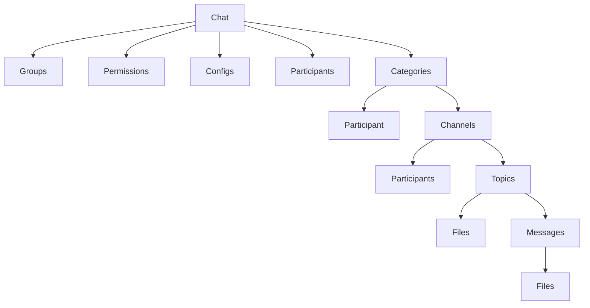
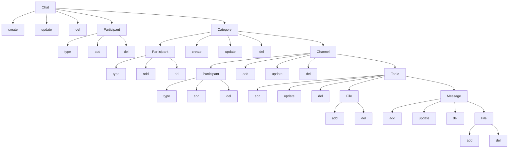

# Chat Module
### Simple chat management

#### Module Dependencies

1. [**App**](https://github.com/DviDev/app-module)
2. [**Base**](https://github.com/DviDev/app-module)

#### Module Optional Relations

1. [**DBMap**](https://github.com/DviDev/dbmap-module)
1. [**Project**](https://github.com/DviDev/project-module)

### Actions

### Requirements
1. Chat
   1. Create
      1. Conditions
      2. Field validations
         1. user_id
            1. [ ] required
            2. [ ] valid
         2. name
            1. [ ] required
   2. Update
       1. Conditions
       2. Field validations
          1. id
             1. [ ] required
          2. name
             1. [ ] required
   3. Delete
       1. Conditions
       2. Field validations
          1. id
             1. [ ] required
   4. Participants
      1. Add
         1. Conditions
         2. Field validations
            1. chat_id
               1. [ ] required
            2. user_id
               1. [ ] required
            3. type
               1. [ ] required
      2. Delete
         1. Conditions
         2. Field validations
            1. participant_id
               1. [ ] required
   5. Categories
       1. Create
          1. Conditions
          2. Field validations
             1. chat_id
                1. [ ] required
             2. name
                1. [ ] required
       2. Update
          1. Conditions
          2. Field validations
             1. id
                1. [ ] required
             2. name
                1. [ ] required
                2. [ ] min length: 2
                3. [ ] max length: 50
       3. Delete
          1. Conditions
          2. Field validations
             1. id
                1. [ ] required
       4. Participants
          1. Add
             1. Conditions
             2. Field validations
                1. chat_id
                   1. [ ] required
                2. user_id
                   1. [ ] required
                3. type
                   1. [ ] required
          2. Delete
             1. Conditions
             2. Field validations
                1. id
                   1. [ ] required
       5. Channels
          1. Create
             1. Conditions
             2. Field validations
                1. category_id
                   1. [ ] required
                2. name
                   1. [ ] required
                   2. [ ] min length: 3
                   3. [ ] max length: 255
          2. Update
             1. Conditions
             2. Field validations
                1. id
                   1. [ ] required
                2. title
                   1. [ ] required
                   2. [ ] min length: 3
                   3. [ ] max length: 255
                3. message
          3. Delete
             1. Conditions
             2. Field validations
                1. id
                   1. [ ] required
          4. Topics
             1. Create
                1. Conditions
                2. Field validations
                   1. channel_id
                      1. [ ] required
                   2. title
                      1. [ ] required
                      2. [ ] min length: 2 words
                      2. [ ] max length: 150
                   3. message
                      1. [ ] max length: 255
                   4. user_id
                      1. [ ] required
             2. Update
                1. Conditions
                2. Field validations
                   1. id
                      1. [ ] required
                   2. title
                      1. [ ] required
                      2. [ ] min length: 3
                      3. [ ] max length: 150
                   3. message
                      1. [ ] max length: 255
             3. Delete
                1. Conditions
                2. Field validations
                   1. id
                      1. [ ] required
             4. Files
                1. Add
                   1. Conditions
                   2. Field validations
                      1. topic_id
                         1. [ ] required
                      2. path
                         1. [ ] required
                2. Delete
                   1. Conditions
                   2. Field validations
                      1. id
                         1. [ ] required
             5. Messages
                1. Create
                   1. Conditions
                   2. Field validations
                      1. topic_id
                         1. [ ] required
                      2. user_id
                         1. [ ] required
                      3. message|file
                         1. [ ] required
                2. Update
                   1. Conditions
                   2. Field validations
                      1. id
                         1. [ ] required
                3. Delete
                   1. Conditions
                   2. Field validations
                      1. id
                         1. [ ] required
                4. Files
                   1. Add
                      1. Conditions
                      2. Field validations
                         1. message_id
                            1. [ ] required
                         2. path
                            1. [ ] required
                   2. Delete
                      1. Conditinos
                      2. Field validations
                         1. id
                            1. [ ] required
