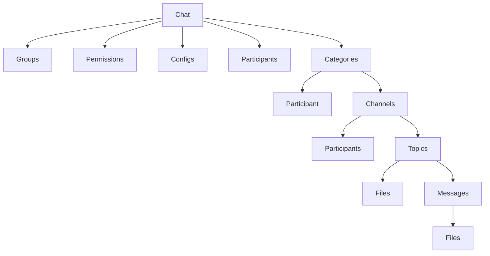
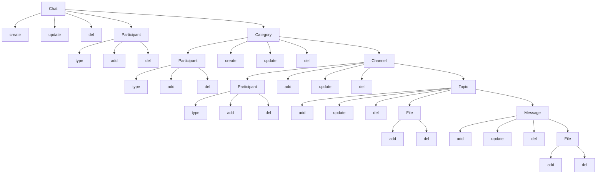

# Chat Module
### Simple chat management

### Actions

### Requirements
1. Chat
   1. Create
      1. Conditions
      2. Field validations
   2. Update
       1. Conditions
       2. Field validations
   3. Delete
       1. Conditions
       2. Field validations
       3. Participants
          1. Add
             1. Conditions
             2. Field validations
          2. Delete
             1. Conditions
             2. Field validations
          3. Type
             1. Conditions
             2. Field validations
       4. Categories
           4. Create
              1. Conditions
              2. Field validations
           5. Update
              1. Conditions
              2. Field validations
           6. Delete
              1. Conditions
              2. Field validations
           7. Participants
              1. Add
                 1. Conditions
                 2. Field validations
              2. Delete
                 1. Conditions
                 2. Field validations
              3. Type
                 1. Conditions
                 2. Field validations
           8. Channels
              1. Create
                 1. Conditions
                 2. Field validations
              2. Update
                 1. Conditions
                 2. Field validations
              3. Delete
                 1. Conditions
                 2. Field validations
              4. Topics
                 1. Create
                    1. Conditions
                    2. Field validations
                 2. Update
                    1. Conditions
                    2. Field validations
                 3. Delete
                    1. Conditions
                    2. Field validations
                 4. Files
                    1. Add
                       1. Conditions
                       2. Field validations
                    2. Delete
                       1. Conditions
                       2. Field validations
                 5. Messages
                    1. Create
                       1. Conditions
                       2. Field validations
                    2. Update
                       1. Conditions
                       2. Field validations
                    3. Delete
                       1. Conditions
                       2. Field validations
                    4. Files
                       1. Add
                          1. Conditions
                          2. Field validations
                       2. Delete
                          1. Conditinos
                          2. Field validations
